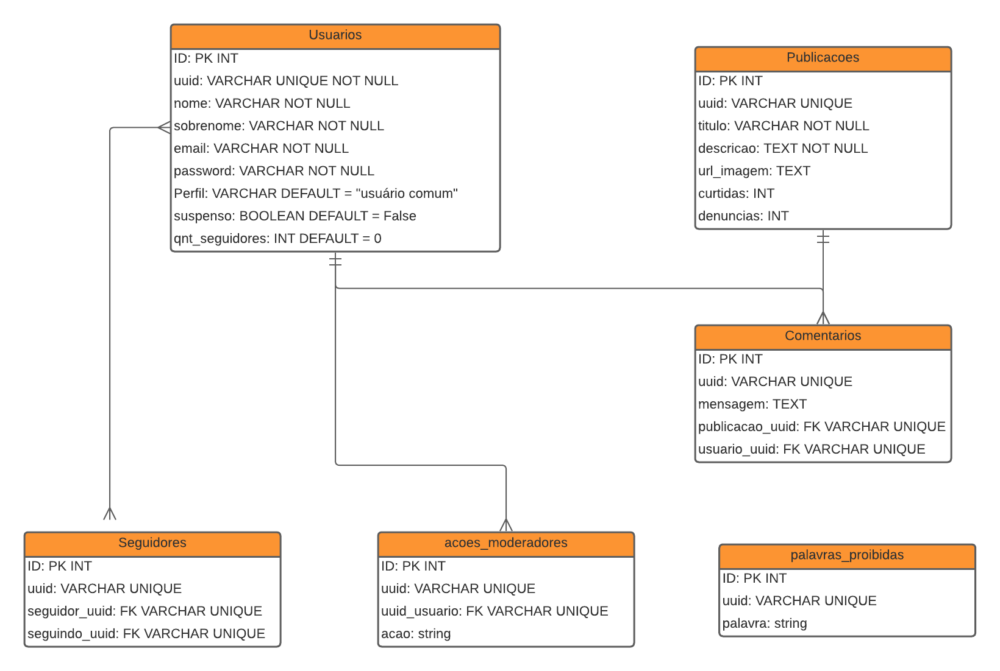
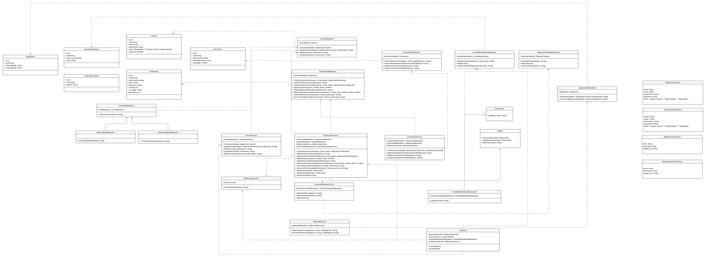

### Trabalho de Rede Social para programadores

## Diagrama banco de dados:

## Diagrama Classes:

## Vídeo explicativo:
link do vídeo: https://drive.google.com/file/d/16ArdrKkpJXLr8nQfEIQ4ol8WY87gtkS5/view?usp=sharing